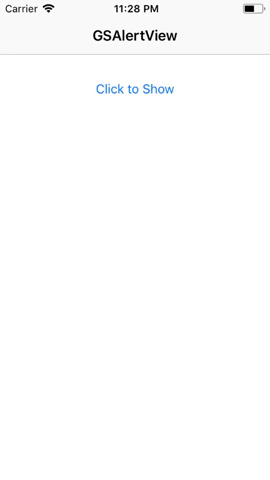

# GSAlertView

[](https://travis-ci.org/greenSyntax/GSAlertView)
[](http://cocoapods.org/pods/GSAlertView)
[](http://cocoapods.org/pods/GSAlertView)
[](http://cocoapods.org/pods/GSAlertView)




## Features

- [x] AlertView with Title and it's Description
- [x] Alert with with Title and its Body Image
- [ ] Alert View with Header Icon with Title and body
- [ ] Fotter View with Image on left and text description


## Installation

GSAlertView is available through [CocoaPods](http://cocoapods.org). To install
it, simply add the following line to your Podfile:

```ruby
pod 'GSAlertView'
```

## Code

#### AlertView with Title and it's Description

```swift

let alert = GSAlertView(title: "Hello World", image: imageSample)
alert.show(animated: true)

```

#### Alert with with Title and its Body Image

```swift

let alert = let alert = GSAlertView(title: "Hello World", description:"This is my description")
alert.show(animated: true)

```

## Author

[Abhishek Kumar Ravi](https://greensyntax.co.in)

## License

GSAlertView is available under the MIT license. See the LICENSE file for more info.
